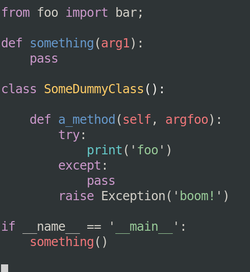
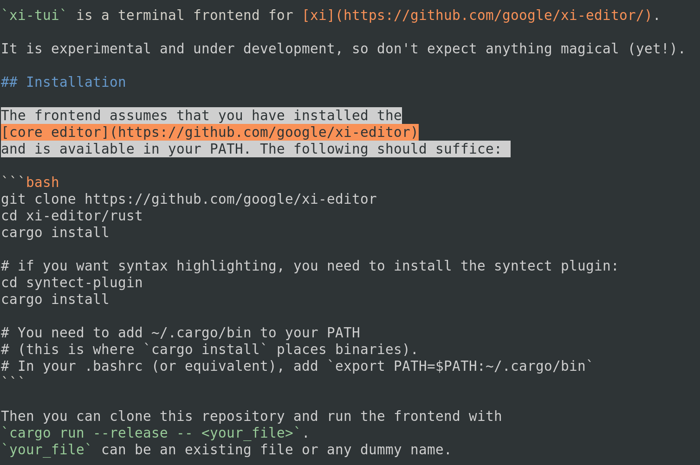

# xi-term

[](https://travis-ci.org/xi-frontend/xi-term)

Formerly `xi-tui`, `xi-term` is a terminal frontend for [xi](https://github.com/xi-editor/xi-editor/).

It is experimental and under development, so don't expect anything magical (yet!).

## Installation

The frontend assumes that you have installed the
[core editor](https://github.com/xi-editor/xi-editor)
and is available in your PATH. The following should suffice:

```bash
git clone https://github.com/xi-editor/xi-editor
cd xi-editor/rust
cargo install --path .

# if you want syntax highlighting, you need to install the syntect plugin:
cd syntect-plugin
make install

# You need to add ~/.cargo/bin to your PATH
# (this is where `cargo install` places binaries).
# In your .bashrc (or equivalent), add `export PATH=$PATH:~/.cargo/bin`
```

Then you can clone this repository and run the frontend with
`cargo run --release -- <your_file>`.
`your_file` can be an existing file or any dummy name.

## Logging

For debugging, it can be useful to have logs.
You can specify a location for log files `xi-term` with `-l <logfile>`.
Two files will be written:

- `<logfile>`: all the `xi-term` logs
- `<logfile>.rpc`: the RPC messages exchanged between the core and the frontend

## Screenshots





## Shortcuts

For now, there are only two shortcuts:

- `^w` saves the current view
- `^c` exits

## Commands
`xi-term` supports a vim-like command prompt for executing commands, accessed
via Alt-X.

Currently supported commands:

| Short form | Long form | Description |
| ---------- | --------- | ----------- |
| q | quit | Quits xi-term |
| s | save | Saves the current file |
| o `filename` | open `filename` | Open `filename` for editing |
| b | backspace | Delete the previous character and move the cursor one position back |
| d | delete | Delete the character under the cursor |
| bn | next-buffer | Switch to the next buffer |
| bp | prev-buffer | Switch to the previous buffer |
| pd | page-down | Advance the current view by one page |
| pu | page-up | Move the current view back by one page |
| ml | move-left | Move the cursor one position left |
| mr | move-right | Move the cursor one position right |
| mu | move-up | Move the cursor one line up |
| md | move-down | Move the cursor one line down |
| t `theme` | theme `theme-name` | Set the theme to `theme`|

Future commands:

| Short form | Long form | Description |
| ---------- | --------- | ----------- |
| c | close | Closes the current view |
| ? `string` | search `string` | Search for `string` |
| sl | select-left | Move the cursor one position left and update the current selection accordingly |
| sr | select-right | Move the cursor one position right and update the current selection accordingly |
| su | select-up | Move the cursor one line up and update the current selection accordingly |
| sd | select-down | Move the cursor one line down and update the current selection accordingly |

## Preferences
Xi-core supports several user-configurable options through a `preferences.xiconfig` file.
The default location for this is `$XDG_CONFIG_HOME/xi/preferences.xiconfig`, or, if
`$XDG_CONFIG_HOME` is not set, it defaults to `$HOME/xi/preferences.xiconfig`.

## Caveats

### Colors

If you have the `syntect` plugin installed, colors will be enabled by default, with two caveats:

- you must have true colors enabled. Otherwise, some portions of text won't be displayed
- the default theme is for dark backgrounds
